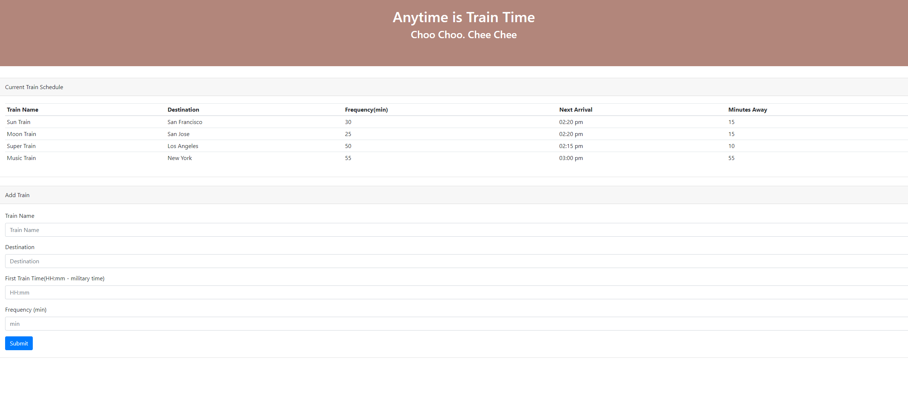
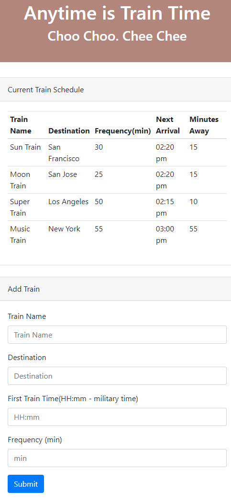

# Train-Scheduler

*I really like and enjoying working on this project. During the process working on this project, I find out how are Front-end connected to the Back-end. How the time can update. The technologies really make people's like more easier.*

## Steps when I work on this project:
- First of all, I will need to create the outlook for the page, and I really want to make this simple.
- Second, I need to link my HTML to my Javascript, they can get the information I put in the table and when I submit the information, the information I put should showing up on the train schedule table
- Thrid, I need to use moment.js to calculate the train time, so it can calculate the next arrival train time and also how many minutes away from the next arrival train.
- Forth, I will have to link my HTML to my database, so it will be able to gather all the input information

## Techonoloies I used in this project:

- HTML
- Bootstrap
- Moment.js
- Javascript
- jQuery
- Firebase

## The image for the full screen size of the website:

## The image of the website with mobile compatible:

## The image on my Firebase gathering all the input datas:
